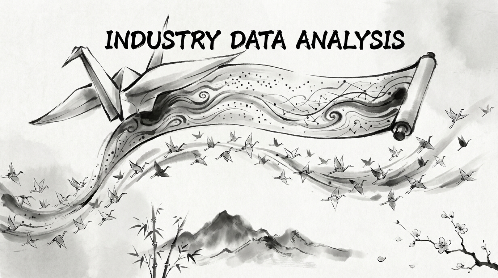

# Industry Data Analysis

<p align="center">
  
</p>

<p align="center">
<b>📊〽️ Interactive market segmentation analysis across industries.</b>
</p>

<p align="center">
<p align="center">
  <a href="#industries-covered">Industries</a> •
  <a href="#requirements">Requirements</a> •
  <a href="#quick-start">Quick Start</a> •
  <a href="#credits">Credits</a> •
  <a href="#about-the-core-contributors">About the Core Contributors</a>
</p>

</p>

<p align="center">
  
  
  
  

</p>

---

<p align="center">
  
</p>


## Industries Covered

Interactive [marimo](https://marimo.io/) notebooks with pie charts and icicle visualizations showing market segments, sizes, and top companies:

| Industry | Notebook | Market Focus |
|----------|----------|--------------|
| Construction | `construction_industry.py` | Residential, infrastructure, non-residential buildings |
| Semiconductor | `semiconductor_industry.py` | Chip design, fabrication, equipment |
| Chemical | `chemical_industry.py` | Specialty chemicals, petrochemicals, materials |
| Cybersecurity | `cyber_industry.py` | Network, endpoint, cloud, identity, GRC |
| Space | `space_industry.py` | Launch, satellites, ground systems |
| Actuators | `actuator_industry.py` | Electric, hydraulic, pneumatic actuators |
| Robotics | `robotics_industry.py` | Industrial, service, collaborative robots |
| Safety Compliance | `safety_compliance_industry.py` | EHS, process safety, aviation/maritime/railway safety |

## Requirements

- [uv](https://docs.astral.sh/uv/)
  ```
  curl -LsSf https://astral.sh/uv/install.sh | sh
  ```

## Quick Start

Run any industry notebook:
```bash
uv run marimo run notebooks/<industry>_industry.py
```

Other commands:
- `make all` - runs `main.py`
- `make fmt` - format code with Black
- `make test` - run all tests

## Credits

This software uses the following tools:
- [marimo](https://marimo.io/) - Reactive Python notebooks
- [Plotly](https://plotly.com/) - Interactive visualizations
- [uv](https://docs.astral.sh/uv/) - Fast Python package manager

## About the Core Contributors

<a href="https://github.com/Miyamura80/IndustryDataAnalysis/graphs/contributors">
  
</a>

Made with [contrib.rocks](https://contrib.rocks).
